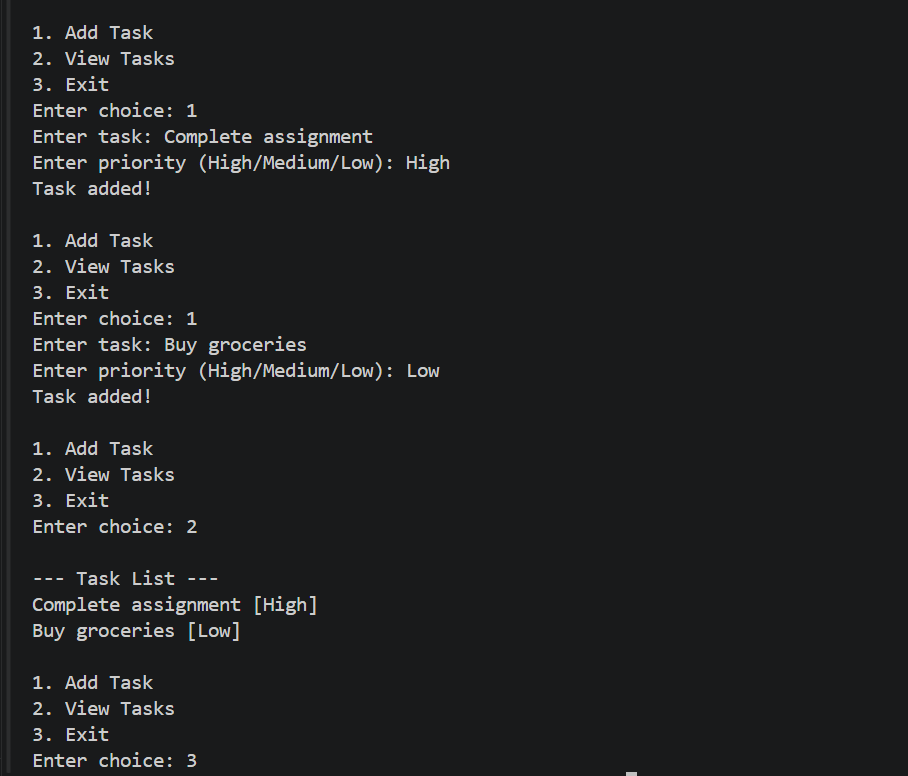

# To-Do List with Priority

##  Problem Statement

Create a Python-based task manager that allows users to manage tasks with priority levels.


##  Features

* Add new tasks
* Assign priority (High / Medium / Low)
* View all tasks
* Simple menu-driven interface

---

##  Technologies Used

* Python
* Lists & Tuples
* Loops & Conditional Statements
* Basic Input/Output

---

##  How to Run

1. Open VS Code or any Python IDE
2. Create a file `todo_list.py`
3. Paste the code
4. Run using:

   ```
   python todo_list.py
   ```

---

##  Output Screenshots

<div align="center">



<br><br>


</div>

---
